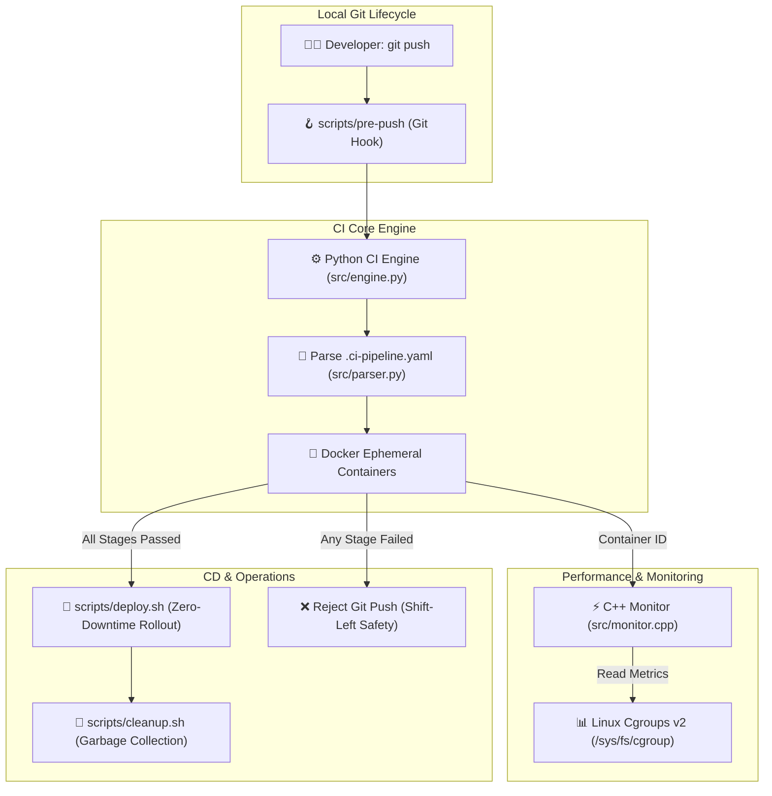

# 🚀 Lightweight GitOps CI/CD Pipeline & Build Engine

[](https://www.linux.org/)
[](https://www.python.org/)
[](https://isocpp.org/)
[](https://www.docker.com/)
[](https://www.gnu.org/software/bash/)
[](https://opensource.org/licenses/MIT)

A lightweight, self-hosted **GitOps CI/CD Runner Engine** and **Containerized Build Platform** built from scratch. Designed for Linux systems, combining Python orchestration, POSIX Bash automation, Docker container isolation, and a high-performance C++ Kernel Cgroups v2 monitor.

---

## 🎯 Architectural Overview



---

## ✨ Key Technical Highlights

1. **Shift-Left GitOps Hook (`scripts/pre-push`):**
   * Automatically triggers local CI pipelines before code leaves the developer machine.
   * Prevents broken builds and failing tests from reaching upstream repositories.

2. **Containerized Execution Engine (`src/engine.py` & `src/parser.py`):**
   * Parses declarative YAML pipeline schemas with strict type validation.
   * Spawns isolated, ephemeral Docker containers (`--rm`) per stage via Docker Unix Socket (`/var/run/docker.sock`).
   * Implements fail-fast execution and real-time ANSI log streaming.

3. **Kernel Cgroups v2 Monitor (`src/monitor.cpp`):**
   * Direct inspection of Linux Cgroups v2 hierarchy (`/sys/fs/cgroup/system.slice/docker-<ID>.scope`).
   * Calculates real-time memory footprint (`memory.current`) and non-blocking CPU percentage delta (`cpu.stat` over $\Delta t$).
   * Graceful signal handling (`SIGINT`/`SIGTERM`) and ANSI color-coded metric dashboard.

4. **Automated CD & Maintenance (`scripts/deploy.sh` & `scripts/cleanup.sh`):**
   * Targeted container replacement with health check verification.
   * Periodic pruning of dangling images, stopped containers, and build caches.

5. **Linux Daemonization (`systemd/lightweight-ci.service`):**
   * Managed via Linux Systemd with auto-restart on failure (`Restart=always`).
   * Dynamic, portable environment resolution during setup.

---

## 📂 Project Structure

```text
lightweight-ci-runner/
├── bin/                          # Compiled C++ binaries (ci-monitor)
├── src/                          # Core source code
│   ├── parser.py                 # [Python] YAML configuration validator
│   ├── engine.py                 # [Python] Docker pipeline orchestrator
│   └── monitor.cpp               # [C++17] Linux Cgroups v2 resource monitor
├── scripts/                      # Automation & GitOps scripts
│   ├── pre-push                  # [Bash] Git pre-push hook trigger
│   ├── deploy.sh                 # [Bash] Safe container deployment
│   └── cleanup.sh                # [Bash] Docker garbage collector
├── systemd/
│   └── lightweight-ci.service    # Systemd service unit template
├── sample-app/                   # Reference application for validation
│   ├── app.py                    # Python application logic
│   ├── test_app.py               # Unit tests (pytest)
│   ├── Dockerfile                # Production container specification
│   └── .ci-pipeline.yaml         # Declarative 3-stage CI pipeline
├── install.sh                    # 1-click installer & setup script
├── Makefile                      # Standard project commands
├── requirements.txt              # Python dependencies
└── README.md                     # Technical architecture documentation
```

---

## 🚀 Quick Start

### 1. Prerequisites
* Linux OS (Ubuntu, Debian, Fedora, Arch, etc.)
* Docker Engine (`docker`)
* Python 3.10+ & `pip`
* `g++` (C++17 support) & `make`

### 2. 1-Click Automated Setup
Clone the repository and run the setup script:
```bash
git clone https://github.com/your-username/lightweight-ci-runner.git
cd lightweight-ci-runner
chmod +x install.sh
./install.sh
```

The installer will:
* Verify system dependencies.
* Install Python requirements (`pip3 install -r requirements.txt`).
* Compile the C++ monitor (`bin/ci-monitor`).
* Grant execution permissions to automation scripts.
* Install the `pre-push` Git Hook into `.git/hooks/`.
* Configure and register the `systemd` service unit.

---

## 🧪 Usage & Testing

### Running the CI Pipeline Manually
```bash
python3 src/engine.py sample-app/.ci-pipeline.yaml
```

### Running the C++ Cgroups Monitor
```bash
# Start a test container
docker run -d --name test-box alpine sh -c "while true; do :; done"

# Monitor resource consumption in real-time
./bin/ci-monitor $(docker inspect --format '{{.Id}}' test-box) 500

# Cleanup
docker rm -f test-box
```

### Running Unit Tests & Linting
```bash
make test    # Run pytest test suite
make lint    # Run flake8 static analysis
make build   # Recompile C++ monitor binary
make clean   # Clean temporary artifacts and cache
```

---

## ⚙️ Pipeline Specification (`.ci-pipeline.yaml`)

```yaml
name: "Sample App CI/CD Pipeline"
version: "1.0"

stages:
  - name: "lint"
    image: "python:3.12-alpine"
    commands:
      - "pip install flake8"
      - "flake8 sample-app/"
    timeout: 60

  - name: "test"
    image: "python:3.12-alpine"
    commands:
      - "pip install pytest"
      - "pytest sample-app/test_app.py"
    timeout: 120

  - name: "build"
    image: "docker:cli"
    commands:
      - "docker build -t sample-app:latest sample-app/"
    timeout: 180
```

---

## 📜 License

Distributed under the MIT License. See [LICENSE](LICENSE) for details.
